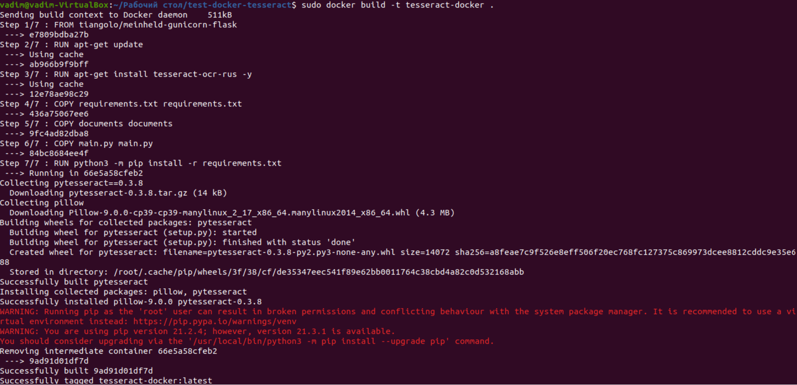
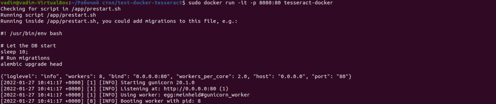

# TESSERACT-DOCKER

example of text extraction from images using tesseract, flask and docker 

description - the service selects a random image from gallery, extracts the text and returns it through the flask endpoint "getResponse"

main script

    main.py
    
    
build image 

    sudo docker build -t tesseract-docker .

    
run container

    sudo docker run -it -p 8080:80 tesseract-docker

random results 

author: Vadim Danilchenko

email: vndanilchenko@gmail.com 